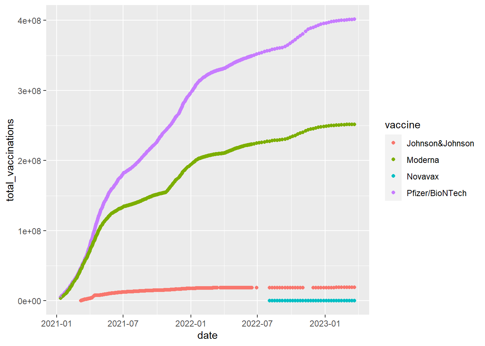
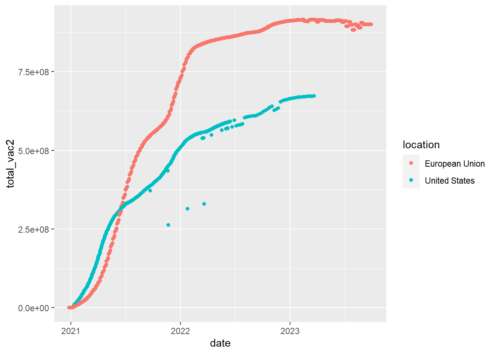

***How to do it?***: 

- Open the Rmarkdown file of this assignment ([link](assignment7.qmd)) in Rstudio. 

- Right under each **question**, insert  a code chunk (you can use the hotkey `Ctrl + Alt + I` to add a code chunk) and code the solution for the question. 

- `Knit` the rmarkdown file (hotkey: `Ctrl + Alt + K`) to export an html.  

-  Publish the html file to your Githiub Page. 

***Submission***: Submit the link on Github of the assignment to Canvas


-------

Use the data of your own.  Produce the following types of plots and comment on each plot. Plots should be meaningful. If you use the data we used in class, make sure the plots are not the same as the ones in the slides. All plots should have title, caption, appropriate labels on x and y-axis. 

-------

1. Make a plot using `facet_wrap` by one categorical variable (`facet_wrap(~variable1)`)

2. Make a plot using `facet_wrap` by two categorical variables (`facet_wrap(~variable1+variable2)`)

3. Make a plot using `position ='dodge'`.

4. Make a plot using `position ='fill'`. 

5. Make a plot using `geom_col`.

6. Change the theme of one of your plots. 

7. Make a plot using combo filter + ggplot

8. Make a plot using combo group_by + summarise + geom_col

9. Save a plot and put a link of the plot to your Github Webpage.  To link a plot `abc.png` you just need to insert the following on the README.md


::: {.cell}

```{.r .cell-code}
[Link to the plot](abc.png)
```
:::


10. In this question, we will use  the Covid19 vaccination data for the US. The data and data dictionary can be found at the below link:

- [Data](https://raw.githubusercontent.com/owid/covid-19-data/master/public/data/vaccinations/vaccinations-by-manufacturer.csv)

- [Alternative Link](https://bryantstats.github.io/math421/data/vaccinations-by-manufacturer.csv)


::: {.cell}

```{.r .cell-code}
library(tidyverse)
df <- read_csv('https://raw.githubusercontent.com/owid/covid-19-data/master/public/data/vaccinations/vaccinations-by-manufacturer.csv')
```
:::


`Geom_point` makes scatter plots, which plot two numeric (or Date) variables. A third categorical variable is often brought in for color. For example, we can compare different vaccine types used in the US by


::: {.cell}

```{.r .cell-code}
df %>% 
  filter(location=='United States') %>% 
  ggplot()+
  geom_point(mapping = aes(x = date, 
                                    y = total_vaccinations, 
                                    color = vaccine))
```

::: {.cell-output-display}
{width=672}
:::
:::


Do the follows. 

  - Use `geom_point` to compare the vaccines used by date in Argentina in 2022. 
  
  - Change `geom_point` to `geom_line` in the above codes to have the corresponding line plots. 

11. (Using the same dataset as in 10.) Sometime we need to do some calculations on the data before plotting. For example, the below codes is to compare the total vaccines (including all types of vaccines) by date between the US and the EU


::: {.cell}

```{.r .cell-code}
# the total vaccines (including all types of vaccines) by date
d1 <- df %>% 
  filter(location %in% c('United States', 'European Union')) %>% 
  group_by(date, location) %>% 
  summarise(total_vac2=sum(total_vaccinations, na.rm=TRUE))

# Plot
d1 %>% 
  ggplot()+
  geom_point(mapping=aes(x=date, 
                         y=total_vac2, 
                         color=location))
```

::: {.cell-output-display}
{width=672}
:::
:::


Notice that the above codes could be piped in one 


::: {.cell}

```{.r .cell-code}
df %>% 
  filter(location %in% c('United States', 'European Union')) %>% 
  group_by(date, location) %>% 
  summarise(total_vac2=sum(total_vaccinations, na.rm=TRUE)) %>% 
  ggplot()+
  geom_point(mapping=aes(x=date, 
                         y=total_vac2, 
                         color=location))
```
:::


Do the follows. 

- Use `geom_point` compare the total vaccines (including all types of vaccines) by date between countries/regions in Asia

- Use `geom_point` compare the total vaccines (including all types of vaccines) by date between countries/regions in South America in 2021


