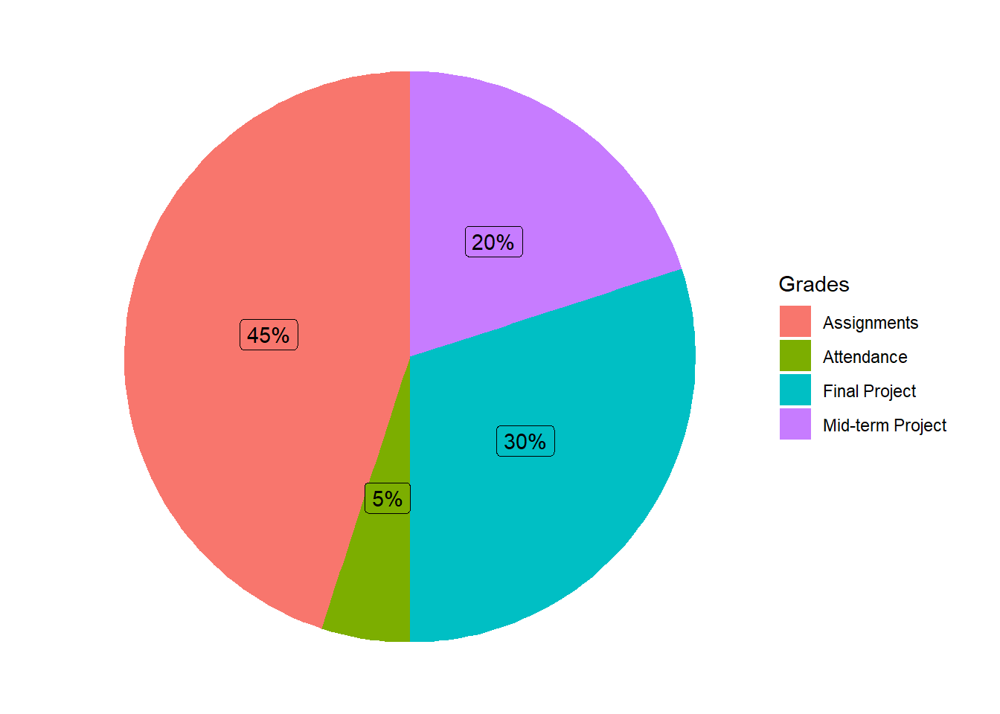

## Course Webpage

[Statistics Analysis with R](https://bryantstats.github.io/math421/)

## Course Description

This course covers the application of R in a wide range of subjects in data analysis. The statistics subjects include descriptive statistics; data visualization; probability distribution; predictive modelling; unsupervised learning. Students also learn about how to write functions in R, Rmarkdown, and various R famous packages such as tidyverse, ggplot2, caret, dplyr.  

## Course Objectives

After completing this course, you should be able to  

- perform statistical descriptive calculation using R 
- implement a variety of data visualization techniques using R.  
- build statistical models, such as linear regression, logistic regression, decision tree on data using R.  
- implement a variety of techniques in statistical unsupervised learning on data using R.  
- produce a data-interactive document and slides presentation to communicate their works using R.  

## Office Hours:

You can find me at my office (A8 - Suite A) from 10:00AM-10:55PM on MWF. I am also available over Zoom (ID: 4419675207) during these times if needed. If these time slots do not work, please feel free to schedule another time with me.

## Grades

::: {.cell}
::: {.cell-output-display}
{width=672}
:::
:::

-   *Mid-term and Final Project*: Projects should be done individually. The logistics and other details of the projects will be updated on the class webpage and Canvas.  

-   *Assignments*: The assignments include, but not limited to, solving statistical problems, writing reports about a statistical technique, and presenting statistical analysis on a dataset.    

-   *Attendance*: Attendance will be checked regularly in class. Missing fewer than four class meetings will guarantee you the full credits for attendance.  The grade for attendance (5%) is enough to move up a letter grade. You are responsible for obtaining course material missed during an absence. 

## Datacamp  

You are required to register an account in Datacamp and to be added to the class.  You will be assigned to take Datacamp courses throughout the semester.  You are responsible for the materials mentioned in the assigned Datacamp courses.  

## Grades Scale

The numerical grades are converted to letter grades as follows.

|     |                |     |                |
|-----|----------------|-----|----------------|
| A   | 92.45 - 100%   | C   | 72.45 - 76.44% |
| A-  | 89.45 - 92.44% | C-  | 69.45 - 72.44% |
| B+  | 86.45 - 89.44% | D+  | 66.45 - 69.44% |
| B   | 82.45 - 86.44% | D   | 59.45 - 66.44% |
| B-  | 79.45 - 82.44% | F   | Below 59.44%   |
| C+  | 76.45 - 79.44% |     |                |

::: {.cell}
::: {.cell-output-display}
{width=672}
:::
:::

## Late Work  

Late assignments are penalized 10% for each day late. You can resubmit your work to improve your score, but the late penalty will apply.  

## Tentative Topics

- R Basics
- Data wrangling with dplyr and tidyverse  
- Handle Missing Values 
- Data Visualization with ggplot2  
- Predictive Modelling  
- Text Mining 
- Writing a function
- Shiny Applications

## Academic Misconduct

Cheating will result in an "F" as your final grade and may result in your expulsion from the University. All cheating will be reported to the Chair of the Mathematics Department and Academic Advising.

## Regarding Diversity

In this course, and all your courses at Bryant, and throughout the Bryant learning community, we value and respect diversity. This includes differences in race, ethnicity, nationality, gender, gender identity, sexuality, socioeconomic status, ability, and religion.

