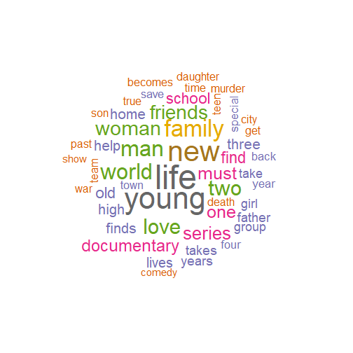

---
title: "Text Mining"
output:
  xaringan::moon_reader:
    lib_dir: libs
    nature:
      highlightStyle: github
      highlightLines: true
      countIncrementalSlides: false
      
   

---
class: inverse, middle, center

---

---

- The first 5 rows and a three columns of the data

<table>
 <thead>
  <tr>
   <th style="text-align:left;"> title </th>
   <th style="text-align:right;"> release_year </th>
   <th style="text-align:left;"> description </th>
  </tr>
 </thead>
<tbody>
  <tr>
   <td style="text-align:left;"> 3% </td>
   <td style="text-align:right;"> 2020 </td>
   <td style="text-align:left;"> In a future where the elite inhabit an island paradise far from the crowded slums, you get one chance to join the 3% saved from squalor. </td>
  </tr>
  <tr>
   <td style="text-align:left;"> 7:19 </td>
   <td style="text-align:right;"> 2016 </td>
   <td style="text-align:left;"> After a devastating earthquake hits Mexico City, trapped survivors from all walks of life wait to be rescued while trying desperately to stay alive. </td>
  </tr>
  <tr>
   <td style="text-align:left;"> 23:59 </td>
   <td style="text-align:right;"> 2011 </td>
   <td style="text-align:left;"> When an army recruit is found dead, his fellow soldiers are forced to confront a terrifying secret that's haunting their jungle island training camp. </td>
  </tr>
  <tr>
   <td style="text-align:left;"> 9 </td>
   <td style="text-align:right;"> 2009 </td>
   <td style="text-align:left;"> In a postapocalyptic world, rag-doll robots hide in fear from dangerous machines out to exterminate them, until a brave newcomer joins the group. </td>
  </tr>
  <tr>
   <td style="text-align:left;"> 21 </td>
   <td style="text-align:right;"> 2008 </td>
   <td style="text-align:left;"> A brilliant group of students become card-counting experts with the intent of swindling millions out of Las Vegas casinos by playing blackjack. </td>
  </tr>
</tbody>
</table>
---
# Token

- A token is a meaningful unit of text. 

- One row of text will be converted to multiple rows of tokens. 
---
<table>
 <thead>
  <tr>
   <th style="text-align:left;"> title </th>
   <th style="text-align:left;"> description </th>
  </tr>
 </thead>
<tbody>
  <tr>
   <td style="text-align:left;"> Avengers: Infinity War </td>
   <td style="text-align:left;"> Superheroes amass to stop intergalactic sociopath Thanos from acquiring a full set of Infinity Stones and wiping out half of all life in the universe. </td>
  </tr>
</tbody>
</table>

---
<table class="table" style="font-size: 12px; margin-left: auto; margin-right: auto;">
 <thead>
  <tr>
   <th style="text-align:left;"> title </th>
   <th style="text-align:left;"> word </th>
  </tr>
 </thead>
<tbody>
  <tr>
   <td style="text-align:left;"> Avengers: Infinity War </td>
   <td style="text-align:left;"> superheroes </td>
  </tr>
  <tr>
   <td style="text-align:left;"> Avengers: Infinity War </td>
   <td style="text-align:left;"> amass </td>
  </tr>
  <tr>
   <td style="text-align:left;"> Avengers: Infinity War </td>
   <td style="text-align:left;"> to </td>
  </tr>
  <tr>
   <td style="text-align:left;"> Avengers: Infinity War </td>
   <td style="text-align:left;"> stop </td>
  </tr>
  <tr>
   <td style="text-align:left;"> Avengers: Infinity War </td>
   <td style="text-align:left;"> intergalactic </td>
  </tr>
  <tr>
   <td style="text-align:left;"> Avengers: Infinity War </td>
   <td style="text-align:left;"> sociopath </td>
  </tr>
  <tr>
   <td style="text-align:left;"> Avengers: Infinity War </td>
   <td style="text-align:left;"> thanos </td>
  </tr>
  <tr>
   <td style="text-align:left;"> Avengers: Infinity War </td>
   <td style="text-align:left;"> from </td>
  </tr>
  <tr>
   <td style="text-align:left;"> Avengers: Infinity War </td>
   <td style="text-align:left;"> acquiring </td>
  </tr>
  <tr>
   <td style="text-align:left;"> Avengers: Infinity War </td>
   <td style="text-align:left;"> a </td>
  </tr>
  <tr>
   <td style="text-align:left;"> Avengers: Infinity War </td>
   <td style="text-align:left;"> full </td>
  </tr>
  <tr>
   <td style="text-align:left;"> Avengers: Infinity War </td>
   <td style="text-align:left;"> set </td>
  </tr>
  <tr>
   <td style="text-align:left;"> Avengers: Infinity War </td>
   <td style="text-align:left;"> of </td>
  </tr>
  <tr>
   <td style="text-align:left;"> Avengers: Infinity War </td>
   <td style="text-align:left;"> infinity </td>
  </tr>
  <tr>
   <td style="text-align:left;"> Avengers: Infinity War </td>
   <td style="text-align:left;"> stones </td>
  </tr>
  <tr>
   <td style="text-align:left;"> Avengers: Infinity War </td>
   <td style="text-align:left;"> and </td>
  </tr>
  <tr>
   <td style="text-align:left;"> Avengers: Infinity War </td>
   <td style="text-align:left;"> wiping </td>
  </tr>
  <tr>
   <td style="text-align:left;"> Avengers: Infinity War </td>
   <td style="text-align:left;"> out </td>
  </tr>
  <tr>
   <td style="text-align:left;"> Avengers: Infinity War </td>
   <td style="text-align:left;"> half </td>
  </tr>
  <tr>
   <td style="text-align:left;"> Avengers: Infinity War </td>
   <td style="text-align:left;"> of </td>
  </tr>
  <tr>
   <td style="text-align:left;"> Avengers: Infinity War </td>
   <td style="text-align:left;"> all </td>
  </tr>
  <tr>
   <td style="text-align:left;"> Avengers: Infinity War </td>
   <td style="text-align:left;"> life </td>
  </tr>
  <tr>
   <td style="text-align:left;"> Avengers: Infinity War </td>
   <td style="text-align:left;"> in </td>
  </tr>
  <tr>
   <td style="text-align:left;"> Avengers: Infinity War </td>
   <td style="text-align:left;"> the </td>
  </tr>
  <tr>
   <td style="text-align:left;"> Avengers: Infinity War </td>
   <td style="text-align:left;"> universe </td>
  </tr>
</tbody>
</table>

---
<table class="table" style="font-size: 12px; margin-left: auto; margin-right: auto;">
 <thead>
  <tr>
   <th style="text-align:left;"> title </th>
   <th style="text-align:left;"> word </th>
  </tr>
 </thead>
<tbody>
  <tr>
   <td style="text-align:left;"> Avengers: Infinity War </td>
   <td style="text-align:left;"> superheroes </td>
  </tr>
  <tr>
   <td style="text-align:left;"> Avengers: Infinity War </td>
   <td style="text-align:left;"> amass </td>
  </tr>
  <tr>
   <td style="text-align:left;"> Avengers: Infinity War </td>
   <td style="text-align:left;"> stop </td>
  </tr>
  <tr>
   <td style="text-align:left;"> Avengers: Infinity War </td>
   <td style="text-align:left;"> intergalactic </td>
  </tr>
  <tr>
   <td style="text-align:left;"> Avengers: Infinity War </td>
   <td style="text-align:left;"> sociopath </td>
  </tr>
  <tr>
   <td style="text-align:left;"> Avengers: Infinity War </td>
   <td style="text-align:left;"> thanos </td>
  </tr>
  <tr>
   <td style="text-align:left;"> Avengers: Infinity War </td>
   <td style="text-align:left;"> acquiring </td>
  </tr>
  <tr>
   <td style="text-align:left;"> Avengers: Infinity War </td>
   <td style="text-align:left;"> full </td>
  </tr>
  <tr>
   <td style="text-align:left;"> Avengers: Infinity War </td>
   <td style="text-align:left;"> set </td>
  </tr>
  <tr>
   <td style="text-align:left;"> Avengers: Infinity War </td>
   <td style="text-align:left;"> infinity </td>
  </tr>
  <tr>
   <td style="text-align:left;"> Avengers: Infinity War </td>
   <td style="text-align:left;"> stones </td>
  </tr>
  <tr>
   <td style="text-align:left;"> Avengers: Infinity War </td>
   <td style="text-align:left;"> wiping </td>
  </tr>
  <tr>
   <td style="text-align:left;"> Avengers: Infinity War </td>
   <td style="text-align:left;"> half </td>
  </tr>
  <tr>
   <td style="text-align:left;"> Avengers: Infinity War </td>
   <td style="text-align:left;"> life </td>
  </tr>
  <tr>
   <td style="text-align:left;"> Avengers: Infinity War </td>
   <td style="text-align:left;"> universe </td>
  </tr>
</tbody>
</table>

---

<table class="table" style="font-size: 10px; margin-left: auto; margin-right: auto;">
 <thead>
  <tr>
   <th style="text-align:left;"> title </th>
   <th style="text-align:left;"> word </th>
  </tr>
 </thead>
<tbody>
  <tr>
   <td style="text-align:left;"> Avengers: Infinity War </td>
   <td style="text-align:left;"> superheroes </td>
  </tr>
  <tr>
   <td style="text-align:left;"> Avengers: Infinity War </td>
   <td style="text-align:left;"> amass </td>
  </tr>
  <tr>
   <td style="text-align:left;"> Avengers: Infinity War </td>
   <td style="text-align:left;"> stop </td>
  </tr>
  <tr>
   <td style="text-align:left;"> Avengers: Infinity War </td>
   <td style="text-align:left;"> intergalactic </td>
  </tr>
  <tr>
   <td style="text-align:left;"> Avengers: Infinity War </td>
   <td style="text-align:left;"> sociopath </td>
  </tr>
  <tr>
   <td style="text-align:left;"> Avengers: Infinity War </td>
   <td style="text-align:left;"> thanos </td>
  </tr>
  <tr>
   <td style="text-align:left;"> Avengers: Infinity War </td>
   <td style="text-align:left;"> acquiring </td>
  </tr>
  <tr>
   <td style="text-align:left;"> Avengers: Infinity War </td>
   <td style="text-align:left;"> full </td>
  </tr>
  <tr>
   <td style="text-align:left;"> Avengers: Infinity War </td>
   <td style="text-align:left;"> set </td>
  </tr>
  <tr>
   <td style="text-align:left;"> Avengers: Infinity War </td>
   <td style="text-align:left;"> infinity </td>
  </tr>
  <tr>
   <td style="text-align:left;"> Avengers: Infinity War </td>
   <td style="text-align:left;"> stones </td>
  </tr>
  <tr>
   <td style="text-align:left;"> Avengers: Infinity War </td>
   <td style="text-align:left;"> wiping </td>
  </tr>
  <tr>
   <td style="text-align:left;"> Avengers: Infinity War </td>
   <td style="text-align:left;"> half </td>
  </tr>
  <tr>
   <td style="text-align:left;"> Avengers: Infinity War </td>
   <td style="text-align:left;"> life </td>
  </tr>
  <tr>
   <td style="text-align:left;"> Avengers: Infinity War </td>
   <td style="text-align:left;"> universe </td>
  </tr>
  <tr>
   <td style="text-align:left;"> Spider-Man 3 </td>
   <td style="text-align:left;"> seemingly </td>
  </tr>
  <tr>
   <td style="text-align:left;"> Spider-Man 3 </td>
   <td style="text-align:left;"> invincible </td>
  </tr>
  <tr>
   <td style="text-align:left;"> Spider-Man 3 </td>
   <td style="text-align:left;"> spider </td>
  </tr>
  <tr>
   <td style="text-align:left;"> Spider-Man 3 </td>
   <td style="text-align:left;"> man </td>
  </tr>
  <tr>
   <td style="text-align:left;"> Spider-Man 3 </td>
   <td style="text-align:left;"> goes </td>
  </tr>
  <tr>
   <td style="text-align:left;"> Spider-Man 3 </td>
   <td style="text-align:left;"> new </td>
  </tr>
  <tr>
   <td style="text-align:left;"> Spider-Man 3 </td>
   <td style="text-align:left;"> crop </td>
  </tr>
  <tr>
   <td style="text-align:left;"> Spider-Man 3 </td>
   <td style="text-align:left;"> villains </td>
  </tr>
  <tr>
   <td style="text-align:left;"> Spider-Man 3 </td>
   <td style="text-align:left;"> third </td>
  </tr>
  <tr>
   <td style="text-align:left;"> Spider-Man 3 </td>
   <td style="text-align:left;"> installment </td>
  </tr>
  <tr>
   <td style="text-align:left;"> Spider-Man 3 </td>
   <td style="text-align:left;"> blockbuster </td>
  </tr>
  <tr>
   <td style="text-align:left;"> Spider-Man 3 </td>
   <td style="text-align:left;"> adventure </td>
  </tr>
  <tr>
   <td style="text-align:left;"> Spider-Man 3 </td>
   <td style="text-align:left;"> series </td>
  </tr>
</tbody>
</table>

---
<table>
 <thead>
  <tr>
   <th style="text-align:left;"> word </th>
   <th style="text-align:right;"> n </th>
  </tr>
 </thead>
<tbody>
  <tr>
   <td style="text-align:left;"> life </td>
   <td style="text-align:right;"> 746 </td>
  </tr>
  <tr>
   <td style="text-align:left;"> young </td>
   <td style="text-align:right;"> 655 </td>
  </tr>
  <tr>
   <td style="text-align:left;"> new </td>
   <td style="text-align:right;"> 613 </td>
  </tr>
  <tr>
   <td style="text-align:left;"> family </td>
   <td style="text-align:right;"> 497 </td>
  </tr>
  <tr>
   <td style="text-align:left;"> man </td>
   <td style="text-align:right;"> 464 </td>
  </tr>
  <tr>
   <td style="text-align:left;"> world </td>
   <td style="text-align:right;"> 453 </td>
  </tr>
  <tr>
   <td style="text-align:left;"> love </td>
   <td style="text-align:right;"> 447 </td>
  </tr>
  <tr>
   <td style="text-align:left;"> two </td>
   <td style="text-align:right;"> 443 </td>
  </tr>
  <tr>
   <td style="text-align:left;"> woman </td>
   <td style="text-align:right;"> 402 </td>
  </tr>
  <tr>
   <td style="text-align:left;"> friends </td>
   <td style="text-align:right;"> 383 </td>
  </tr>
</tbody>
</table>

---
<!-- -->

---
class: center
<!-- -->
---
# Sentiment Analysis

<table>
 <thead>
  <tr>
   <th style="text-align:left;"> title </th>
   <th style="text-align:left;"> description </th>
  </tr>
 </thead>
<tbody>
  <tr>
   <td style="text-align:left;"> Avengers: Infinity War </td>
   <td style="text-align:left;"> Superheroes amass to stop intergalactic sociopath Thanos from acquiring a full set of Infinity Stones and wiping out half of all life in the universe. </td>
  </tr>
</tbody>
</table>

---
<table class="table" style="font-size: 12px; margin-left: auto; margin-right: auto;">
 <thead>
  <tr>
   <th style="text-align:left;"> title </th>
   <th style="text-align:left;"> word </th>
  </tr>
 </thead>
<tbody>
  <tr>
   <td style="text-align:left;"> Avengers: Infinity War </td>
   <td style="text-align:left;"> superheroes </td>
  </tr>
  <tr>
   <td style="text-align:left;"> Avengers: Infinity War </td>
   <td style="text-align:left;"> amass </td>
  </tr>
  <tr>
   <td style="text-align:left;"> Avengers: Infinity War </td>
   <td style="text-align:left;"> to </td>
  </tr>
  <tr>
   <td style="text-align:left;"> Avengers: Infinity War </td>
   <td style="text-align:left;"> stop </td>
  </tr>
  <tr>
   <td style="text-align:left;"> Avengers: Infinity War </td>
   <td style="text-align:left;"> intergalactic </td>
  </tr>
  <tr>
   <td style="text-align:left;"> Avengers: Infinity War </td>
   <td style="text-align:left;"> sociopath </td>
  </tr>
  <tr>
   <td style="text-align:left;"> Avengers: Infinity War </td>
   <td style="text-align:left;"> thanos </td>
  </tr>
  <tr>
   <td style="text-align:left;"> Avengers: Infinity War </td>
   <td style="text-align:left;"> from </td>
  </tr>
  <tr>
   <td style="text-align:left;"> Avengers: Infinity War </td>
   <td style="text-align:left;"> acquiring </td>
  </tr>
  <tr>
   <td style="text-align:left;"> Avengers: Infinity War </td>
   <td style="text-align:left;"> a </td>
  </tr>
  <tr>
   <td style="text-align:left;"> Avengers: Infinity War </td>
   <td style="text-align:left;"> full </td>
  </tr>
  <tr>
   <td style="text-align:left;"> Avengers: Infinity War </td>
   <td style="text-align:left;"> set </td>
  </tr>
  <tr>
   <td style="text-align:left;"> Avengers: Infinity War </td>
   <td style="text-align:left;"> of </td>
  </tr>
  <tr>
   <td style="text-align:left;"> Avengers: Infinity War </td>
   <td style="text-align:left;"> infinity </td>
  </tr>
  <tr>
   <td style="text-align:left;"> Avengers: Infinity War </td>
   <td style="text-align:left;"> stones </td>
  </tr>
  <tr>
   <td style="text-align:left;"> Avengers: Infinity War </td>
   <td style="text-align:left;"> and </td>
  </tr>
  <tr>
   <td style="text-align:left;"> Avengers: Infinity War </td>
   <td style="text-align:left;"> wiping </td>
  </tr>
  <tr>
   <td style="text-align:left;"> Avengers: Infinity War </td>
   <td style="text-align:left;"> out </td>
  </tr>
  <tr>
   <td style="text-align:left;"> Avengers: Infinity War </td>
   <td style="text-align:left;"> half </td>
  </tr>
  <tr>
   <td style="text-align:left;"> Avengers: Infinity War </td>
   <td style="text-align:left;"> of </td>
  </tr>
  <tr>
   <td style="text-align:left;"> Avengers: Infinity War </td>
   <td style="text-align:left;"> all </td>
  </tr>
  <tr>
   <td style="text-align:left;"> Avengers: Infinity War </td>
   <td style="text-align:left;"> life </td>
  </tr>
  <tr>
   <td style="text-align:left;"> Avengers: Infinity War </td>
   <td style="text-align:left;"> in </td>
  </tr>
  <tr>
   <td style="text-align:left;"> Avengers: Infinity War </td>
   <td style="text-align:left;"> the </td>
  </tr>
  <tr>
   <td style="text-align:left;"> Avengers: Infinity War </td>
   <td style="text-align:left;"> universe </td>
  </tr>
</tbody>
</table>

---
<table class="table" style="font-size: 12px; margin-left: auto; margin-right: auto;">
 <thead>
  <tr>
   <th style="text-align:left;"> title </th>
   <th style="text-align:left;"> word </th>
  </tr>
 </thead>
<tbody>
  <tr>
   <td style="text-align:left;"> Avengers: Infinity War </td>
   <td style="text-align:left;"> superheroes </td>
  </tr>
  <tr>
   <td style="text-align:left;"> Avengers: Infinity War </td>
   <td style="text-align:left;"> amass </td>
  </tr>
  <tr>
   <td style="text-align:left;"> Avengers: Infinity War </td>
   <td style="text-align:left;"> stop </td>
  </tr>
  <tr>
   <td style="text-align:left;"> Avengers: Infinity War </td>
   <td style="text-align:left;"> intergalactic </td>
  </tr>
  <tr>
   <td style="text-align:left;"> Avengers: Infinity War </td>
   <td style="text-align:left;"> sociopath </td>
  </tr>
  <tr>
   <td style="text-align:left;"> Avengers: Infinity War </td>
   <td style="text-align:left;"> thanos </td>
  </tr>
  <tr>
   <td style="text-align:left;"> Avengers: Infinity War </td>
   <td style="text-align:left;"> acquiring </td>
  </tr>
  <tr>
   <td style="text-align:left;"> Avengers: Infinity War </td>
   <td style="text-align:left;"> full </td>
  </tr>
  <tr>
   <td style="text-align:left;"> Avengers: Infinity War </td>
   <td style="text-align:left;"> set </td>
  </tr>
  <tr>
   <td style="text-align:left;"> Avengers: Infinity War </td>
   <td style="text-align:left;"> infinity </td>
  </tr>
  <tr>
   <td style="text-align:left;"> Avengers: Infinity War </td>
   <td style="text-align:left;"> stones </td>
  </tr>
  <tr>
   <td style="text-align:left;"> Avengers: Infinity War </td>
   <td style="text-align:left;"> wiping </td>
  </tr>
  <tr>
   <td style="text-align:left;"> Avengers: Infinity War </td>
   <td style="text-align:left;"> half </td>
  </tr>
  <tr>
   <td style="text-align:left;"> Avengers: Infinity War </td>
   <td style="text-align:left;"> life </td>
  </tr>
  <tr>
   <td style="text-align:left;"> Avengers: Infinity War </td>
   <td style="text-align:left;"> universe </td>
  </tr>
</tbody>
</table>

---
# Using `nrc`

