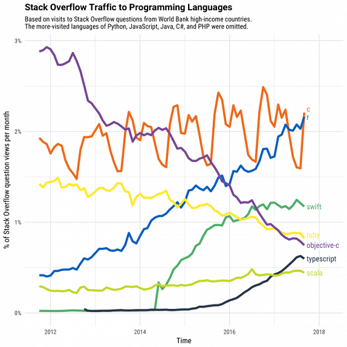
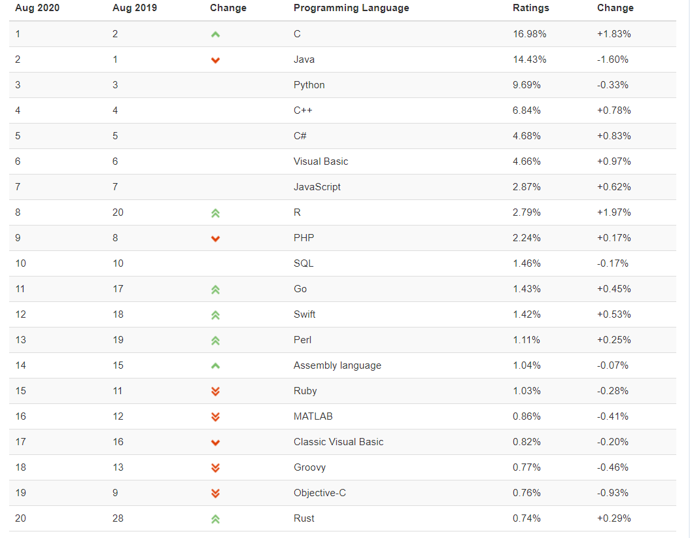
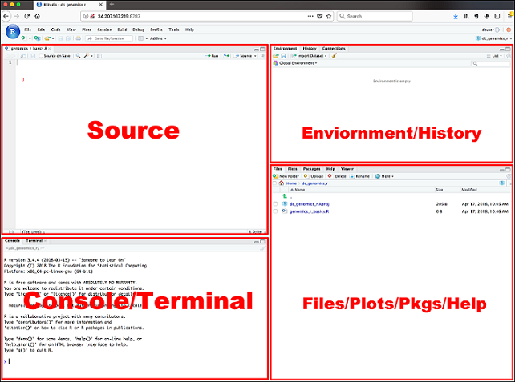

```{r setup, include=FALSE}
options(htmltools.dir.version = FALSE)
```

```{r xaringan-tile-view, echo=FALSE}
xaringanExtra::use_tile_view()
```


```{r xaringan-panelset, echo=FALSE}
xaringanExtra::use_panelset()
```

```{r, echo=FALSE}
xaringanExtra::use_webcam()
```

```{r xaringan-fit-screen, echo=FALSE}
xaringanExtra::use_fit_screen()
```


# Table of Content

1. R in Statistical Analysis

2. R vs. Rstudio 

3. Rstudio 

4. Workflow

---

class: inverse, center, middle

# R in Statistical Analysis

---
class: center


Percentage of Matching Job Posting on Indeed.com to Statistics Jobs involving R, SAS and Python

---
class: center


---

class: center


Most Popular Programming Languang by TIBOE

---
# More from TIBOE

[Link](https://www.tiobe.com/tiobe-index/)

---
# Why the huge jump from 2019 to 2020?

--
- [Covid 19 Research] (https://www.infoworld.com/article/3565552/r-language-rises-with-covid-19-research.html)

--

- [Top 100 R resources for Covid 19](https://towardsdatascience.com/top-5-r-resources-on-covid-19-coronavirus-1d4c8df6d85f)

- [covid19-r
](https://mine-cetinkaya-rundel.github.io/covid19-r/)

---
class: inverse, center, middle

# R vs. Rstudio

---
# R vs. Rstudio

--


- R is a **programming language**


--


- Rsudio is an **editor**


--

- Rsudio makes it easier to write R codes. 


--


- Do we need Rstudio to run R? 
--
**No!**

--

- Do we need R to code in Rstudio? 
--
**Yes!**

---
class: center

# Rstudio Overview



---
# Workflow

- Write R in Rstudio Environment

- Showcase the result by Rmarkdown

- Publish the result via Github

---
class: inverse, middle, center

# Your Turn

Setup your workflow

---
class: inverse

# Assignment 1: Setting it up

- Download and Install R at: https://cran.r-project.org/bin/windows/base/old/4.1.1

- Download and Install Rstudio at:
https://download1.rstudio.org/desktop/windows/RStudio-2022.07.1-554.exe

- Download and Install Git at: https://github.com/git-for-windows/git/releases/download/v2.37.3.windows.1/Git-2.37.3-64-bit.exe

- While waiting for the installation, sign up for an account at Github: https://github.com/
---

class: inverse

# Create a workflow and publish your first assignment

- Follow this video to publish your first assignment: 

  https://www.loom.com/share/3d6e0766edc0403badfc9df2bad4bb7f

- Submit the link of your Github Page to to Canvas under Assignment 1
